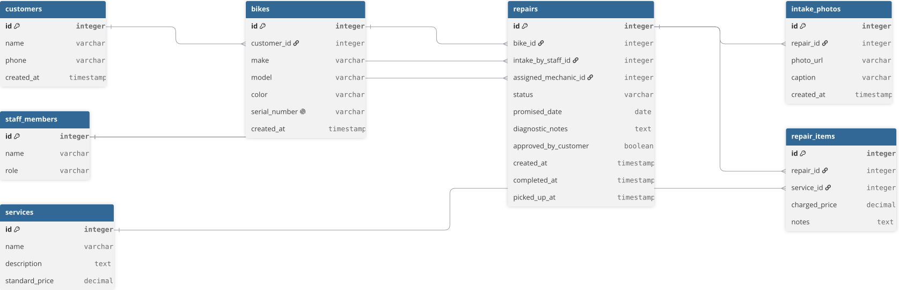

# Domain Model and Lifecycle

This document presents the relational data model, entity traceability, lifecycle state transitions, and design decisions for Wheelhouse.

## 1. Relational Diagram



### DBML Code (dbdiagram.io)

```dbml
Table customers {
  id integer [pk, increment]
  name varchar
  phone varchar
  created_at timestamp
}

Table bikes {
  id integer [pk, increment]
  customer_id integer [ref: > customers.id]
  make varchar
  model varchar
  color varchar
  serial_number varchar [unique]
  created_at timestamp
}

Table staff_members {
  id integer [pk, increment]
  name varchar
  role varchar
}

Table services {
  id integer [pk, increment]
  name varchar
  description text
  standard_price decimal
}

Table repairs {
  id integer [pk, increment]
  bike_id integer [ref: > bikes.id]
  intake_by_staff_id integer [ref: > staff_members.id]
  assigned_mechanic_id integer [ref: > staff_members.id, null]
  status varchar
  promised_date date
  diagnostic_notes text
  approved_by_customer boolean [null]
  created_at timestamp
  completed_at timestamp [null]
  picked_up_at timestamp [null]
}

Table intake_photos {
  id integer [pk, increment]
  repair_id integer [ref: > repairs.id]
  photo_url varchar
  caption varchar
  created_at timestamp
}

Table repair_items {
  id integer [pk, increment]
  repair_id integer [ref: > repairs.id]
  service_id integer [ref: > services.id]
  charged_price decimal
  notes text
}
```

## 2. Repair Lifecycle

### Allowed States

- Received: Bike is in the shop and tagged.
- Diagnosed: Mechanic inspected the bike and wrote notes.
- Awaiting Approval: Staff called customer with the estimated cost.
- In Progress: Customer approved and mechanic is working on the bike.
- Ready for Pickup: Work is complete and bike is on the ready rack.
- Completed: Customer paid and took the bike home.
- Declined: Customer rejected the estimate and picked up the untouched bike.

### Allowed Transitions

- Received -> Diagnosed: Mechanic finishes technical inspection.
- Diagnosed -> In Progress: Simple repairs that do not need phone confirmation.
- Diagnosed -> Awaiting Approval: Complex repairs that require customer agreement.
- Awaiting Approval -> In Progress: Customer accepts the estimate.
- Awaiting Approval -> Declined: Customer rejects the estimate.
- In Progress -> Ready for Pickup: Mechanic finishes all repair jobs.
- Ready for Pickup -> Completed: Customer pays and collects the bike.
- Declined -> Completed: Customer collects the untouched bike.

### Disallowed Transitions

- Received -> Ready for Pickup: A bike cannot be marked ready without diagnosis and work.
- Received -> Completed: A bike cannot leave the shop directly on arrival.
- Awaiting Approval -> Ready for Pickup: Work cannot be finished before customer approval.
- Completed -> In Progress: A closed repair cannot be reopened.

## 3. Entity Traceability

| Entity | Story | Justification |
|---|---|---|
| customers | Story 1 | Needed to store customer contact information. |
| bikes | Story 1, 10 | Needed to identify physical bikes and store maintenance history by serial number. |
| staff_members | Story 1, 6, 9 | Needed to distinguish counter staff, mechanics, and the shop owner. |
| services | Story 7, 11, 12 | Needed for the standard price list on the wall and website. |
| repairs | Story 1, 2, 8, 9 | Needed to track the intake, promised date, notes, and repair status. |
| intake_photos | Story 5 | Needed to store photos of initial scratches and damage. |
| repair_items | Story 7, 11 | Needed to connect services to a repair with historical prices. |

## 4. Design Decisions

### The Thing and the Copy of the Thing

In March, the shop gave back the wrong bike because two customers brought the same bike model, two blue Trek Marlins. A single bike table with a name and a quantity number cannot tell two physical bikes apart. Our model uses a separate bike record with a unique serial number. This makes sure every physical bike is tracked on its own, even when they have the same brand, model, and color.

### Derived vs. Stored Values

- Derived value: The overdue status of a repair is not stored in the database. It is calculated by comparing the promised date with today's date. Storing a true/false column requires daily updates and can show wrong data.
- Stored value: The charged price in the repair items table is saved as a fixed number. If we only read the price from the services catalog, the price update in January would change past customer invoices. Storing the charged price protects old receipts.
