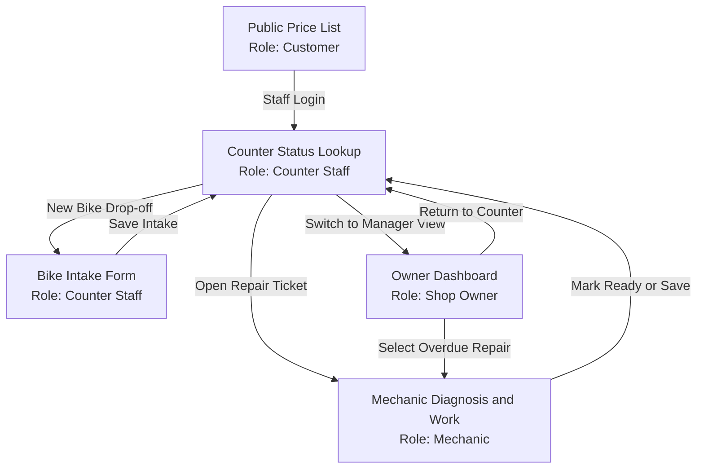
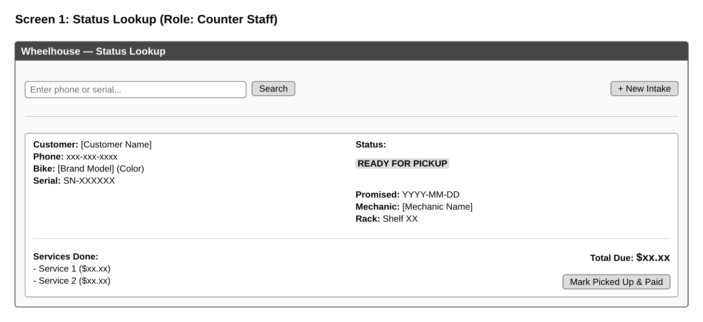
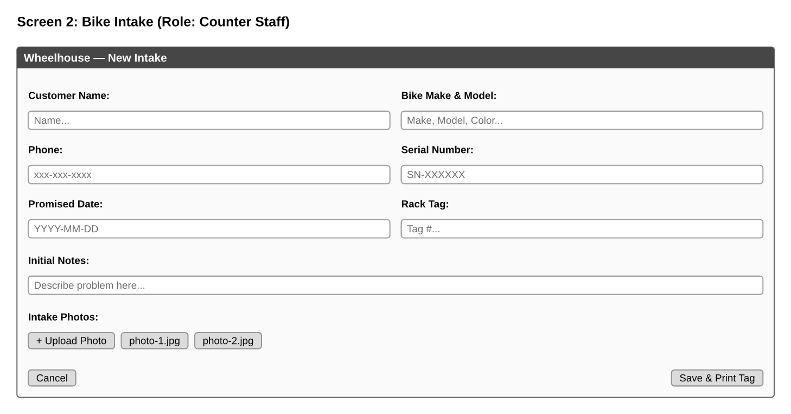
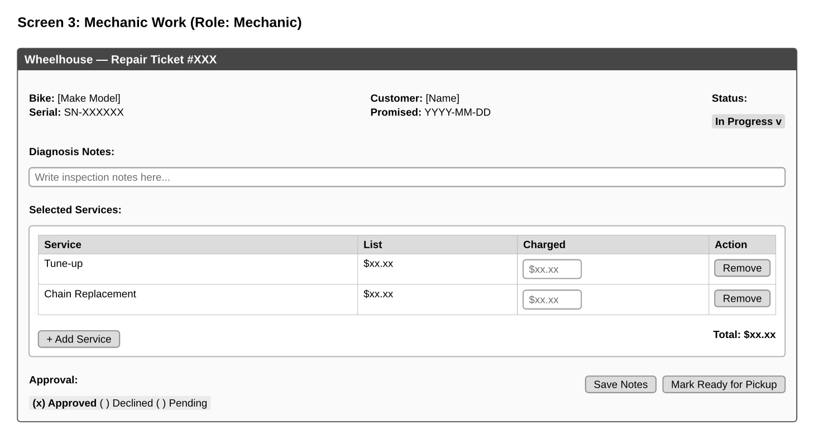
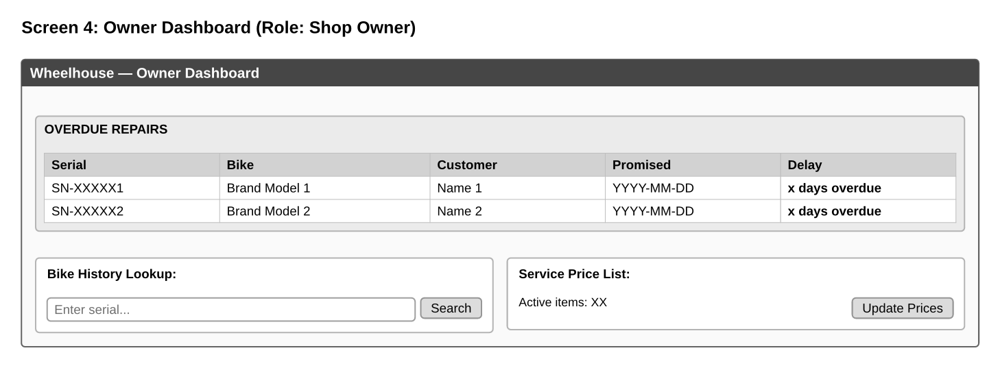

# Wireframes and Navigation

This document presents the low-fidelity screen wireframes, the role associated with each view, and the screen navigation graph for Wheelhouse.

## 1. Navigation Graph

## 2. Screen Wireframes

### Screen 1: Counter Status Lookup
- Role: Counter Staff
- Purpose: Check repair progress instantly when a customer calls or visits the shop.

Key elements on screen:
- Search input for customer phone number or bike serial number.
- Matched repair card showing customer name, bike model, promised date, and current status.
- Storage rack location tag to find the physical bike quickly.
- Itemized list of completed services and total amount due.
- Action button to mark the bike picked up and paid.

---

### Screen 2: Bike Intake Registration
- Role: Counter Staff
- Purpose: Record customer information, bike serial number, promised date, and damage photos during drop-off.

Key elements on screen:
- Customer contact fields: full name and phone number.
- Bike identity fields: make, model, color, and unique serial number.
- Promised completion day selection.
- Customer initial problem description box.
- Upload section for intake condition photos to document existing scratches.
- Save intake button that creates the repair ticket and prints the physical handlebar tag.

---

### Screen 3: Mechanic Technical Diagnosis and Work
- Role: Mechanic
- Purpose: Write detailed mechanical diagnosis notes, select services from the wall list, adjust prices, and record customer approval.

Key elements on screen:
- Repair header showing bike details, serial number, and current status.
- Multi-line text area for the detailed technical diagnosis paragraph.
- Service selection table from the wall list catalog with individual price override input.
- Customer quote decision radio buttons: Approved, Declined, or Pending Call.
- Action button to mark work finished and move status to Ready for Pickup.

---

### Screen 4: Shop Owner Dashboard and Overdue Tracking
- Role: Shop Owner
- Purpose: Monitor workshop throughput, identify delayed repairs past their promised date, and manage service catalog prices.

Key elements on screen:
- Overdue repairs monitor table sorted by delay, showing days overdue and promised dates.
- Direct link to open any overdue repair and reassign mechanics.
- Serial number lookup tool to view the full service history of any physical bicycle across previous owners.
- Shortcut to update standard service catalog prices for the annual review.
